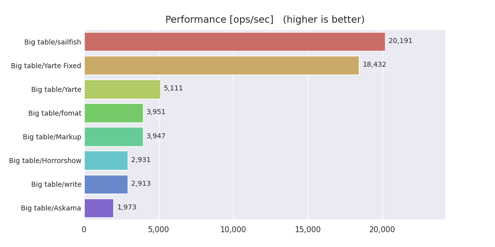
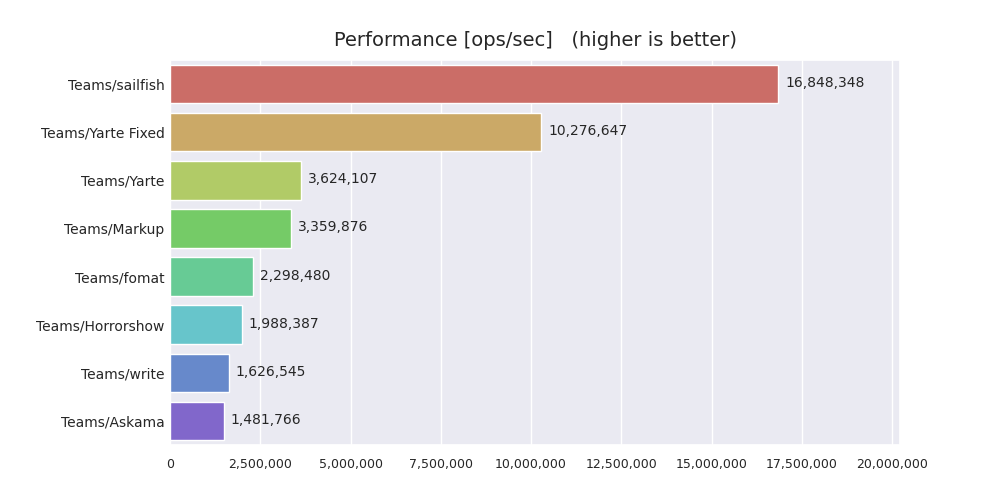

# Rust template engine benchmarks

Performance comparison of template engines for Rust based on [criterion](https://github.com/bheisler/criterion.rs) crate

## crates

- [askama](https://github.com/djc/askama): Type-safe, compiled Jinja-like templates for Rust
- [fomat](https://github.com/krdln/fomat-macros): Alternative syntax for printing macros in Rust
- [handlebars](https://github.com/sunng87/handlebars-rust): Handlebars templating language implemented in Rust and for Rust.
- [horrorshow](https://github.com/Stebalien/horrorshow-rs): A macro-based html builder for rust
- [liquid](https://github.com/cobalt-org/liquid-rust): the liquid templating language for Rust
- [markup](https://github.com/utkarshkukreti/markup.rs): A blazing fast, type-safe template engine for Rust.
- [maud](https://github.com/lambda-fairy/maud): Compile-time HTML templates for Rust
- [ramhorns](https://github.com/maciejhirsz/ramhorns): Fast Mustache template engine implementation in pure Rust
- [ructe](https://github.com/kaj/ructe): Rust Compiled Templates with static-file handling
- [std::write!](https://doc.rust-lang.org/std/macro.write.html): the std library `write!` macro
- [tera](https://github.com/Keats/tera): A template engine for Rust based on Jinja2/Django
- [yarte](https://github.com/botika/yarte): Yet Another Rust Template Engine, is the fastest template engine
- [sailfish](https://github.com/Kogia-sima/sailfish): Simple, small, and extremely fast template engine for Rust

## Running the benchmarks

```console
$ cargo bench
```

## Environment

- OS: Ubuntu 20.04 LTS
- CPU Model Name: Intel(R) Core(TM) i5-8265U CPU @ 1.60GHz
- BogoMIPS: 3600.00

## Results

- Big table



- Teams



## License

Copyright (c) 2020 Dirkjan Ochtman and Ryohei Machida

This benchmark code is distributed under the special permission granted by [Dirkjan Ochtman](https://github.com/djc) (See [this issue](https://github.com/djc/template-benchmarks-rs/issues/26)).
**You cannot modify or redistribute the source code without an explicit permission**.
