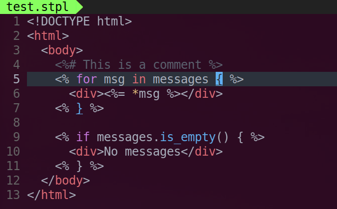

# Syntax Highlighting for Sailfish Templates in Vim

## Installation

### Using dein.vim

```
call dein#add('rust-sailfish/sailfish', {'rtp': 'syntax/vim'})
```

### Using vim-plug

```
Plug 'rust-sailfish/sailfish', { 'rtp': 'syntax/vim' }
```

## Screenshot


