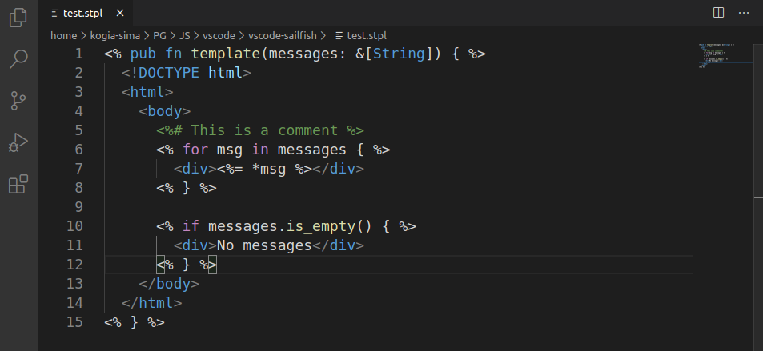

# Syntax Highlighting for Sailfish Templates in VSCode

This directory contains Syntax Highlighting extension for sailfish templates in Visual Studio Code.

The extension is available at [VisualStudio Marketplace](https://marketplace.visualstudio.com/items?itemName=kogia-sima.vscode-sailfish).

## Features

- Full Rust syntax highlighting rules inside code blocks
- Auto-closing brackets for code blocks
- Folding for comment blocks

## Screenshots

